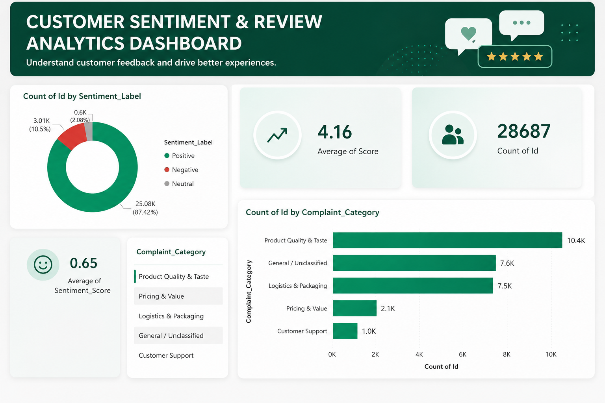

<div align="center">

# 📊 Customer Sentiment & Review Analytics

### Turning Customer Reviews into Actionable Business Insights

<p>
  
  
  
  
</p>

<p>
  <b>Python EDA</b> → <b>Data Cleaning</b> → <b>SQL Analysis</b> → <b>Power BI</b> → <b>Business Insights</b>
</p>

</div>

---

## 📌 Project Overview

Customer reviews contain valuable information about **product quality, pricing, logistics, packaging, and customer support**. However, analyzing thousands of reviews manually makes it difficult for businesses to identify the most important customer pain points.

This project analyzes **28,687 customer reviews** and transforms the data into an interactive **Customer Sentiment & Review Analytics Dashboard** using:

* 🐍 **Python & Pandas** for data cleaning and exploratory analysis
* 🗄️ **SQL** for analytical queries and aggregations
* 📊 **Power BI** for interactive visualization and dashboarding
* 💡 **Business analysis** to identify major complaint drivers

The objective was to answer a simple business question:

> **What are customers saying, where are the major pain points, and which areas should the business prioritize?**

---

## 🎯 Business Questions

The analysis focuses on answering the following questions:

1. What is the overall customer sentiment?
2. What percentage of reviews are positive, negative, and neutral?
3. What is the average customer rating?
4. Which complaint categories receive the highest volume of feedback?
5. Which operational areas may require the most attention?
6. How can customer feedback be converted into actionable business insights?

---

## 🔄 End-to-End Analytics Workflow

```text
                    RAW CUSTOMER REVIEWS
                            │
                            ▼
                  ┌───────────────────┐
                  │ Python / Pandas   │
                  │ Data Cleaning     │
                  │ EDA & Processing  │
                  └─────────┬─────────┘
                            │
                            ▼
                  PROCESSED REVIEW DATA
                            │
                            ▼
                  ┌───────────────────┐
                  │       SQL         │
                  │ Aggregations      │
                  │ Grouping & KPIs   │
                  └─────────┬─────────┘
                            │
                            ▼
                  ┌───────────────────┐
                  │     Power BI      │
                  │ Visualization     │
                  │ Dashboard         │
                  └─────────┬─────────┘
                            │
                            ▼
                  BUSINESS INSIGHTS
```

---

## 📂 Dataset

**Source:** Kaggle — Datafiniti Consumer Reviews of Amazon Products

The dataset contains customer review information including product, rating, review-related attributes, and sentiment-related information.

### Dataset Scale

| Metric                  |           Value |
| ----------------------- | --------------: |
| Total Reviews           |      **28,687** |
| Average Rating          | **4.16 / 5.00** |
| Average Sentiment Score |        **0.65** |
| Positive Reviews        |      **25.08K** |
| Negative Reviews        |       **3.01K** |
| Neutral Reviews         |       **0.60K** |

---

# 🐍 Phase 1 — Python Data Cleaning & EDA

The first stage of the project was performed using **Python and Jupyter Notebook**.

### Key Steps

#### 1. Data Loading

The dataset was loaded and inspected using Pandas.

```python
import pandas as pd

df = pd.read_csv("your_dataset.csv")

df.head()
df.info()
df.shape
```

#### 2. Data Quality Checks

The dataset was checked for:

* Missing values
* Duplicate records
* Incorrect data types
* Inconsistent text values
* Data quality issues

Example:

```python
df.isnull().sum()
df.duplicated().sum()
df.dtypes
```

#### 3. Data Cleaning & Preparation

The review data was cleaned and standardized before analysis.

This included:

* Handling missing values
* Removing unnecessary whitespace
* Standardizing text values
* Preparing categorical variables
* Preparing sentiment-related fields
* Creating business-oriented complaint categories

### Complaint Categories

Customer feedback was organized into:

* **Product Quality & Taste**
* **General / Unclassified**
* **Logistics & Packaging**
* **Pricing & Value**
* **Customer Support**

#### 4. Processed Dataset

After preprocessing, the cleaned dataset was exported as:

`processed_sentiment_data.csv`

This processed dataset was then used for SQL analysis and Power BI reporting.

---

# 🗄️ Phase 2 — SQL Analysis

SQL was used to perform analytical queries on the processed review data.

The analysis focused on:

* KPI calculations
* Review counts
* Average ratings
* Sentiment distribution
* Complaint-category analysis
* Percentage calculations
* Sorting and aggregation

### Example 1 — Overall KPIs

```sql
SELECT 
    COUNT(Id) AS Total_Reviews,
    ROUND(AVG(Score), 2) AS Average_Star_Rating,
    ROUND(AVG(Sentiment_Score), 2) AS Average_Sentiment_Score
FROM processed_sentiment_data;
```

### Example 2 — Complaint Category Analysis

```sql
SELECT 
    Complaint_Category,
    COUNT(Id) AS Total_Complaints
FROM processed_sentiment_data
GROUP BY Complaint_Category
ORDER BY Total_Complaints DESC;
```

### Example 3 — Sentiment Distribution

```sql
SELECT 
    Sentiment_Label,
    COUNT(Id) AS Total_Count,
    ROUND(
        COUNT(Id) * 100.0 /
        (SELECT COUNT(*) FROM processed_sentiment_data),
        2
    ) AS Percentage
FROM processed_sentiment_data
GROUP BY Sentiment_Label;
```

### SQL Skills Demonstrated

* `SELECT`
* `WHERE`
* `GROUP BY`
* `ORDER BY`
* `COUNT()`
* `AVG()`
* `ROUND()`
* Aggregate functions
* Subqueries
* Percentage calculations
* Business-oriented data aggregation

---

# 📊 Phase 3 — Power BI Dashboard

The processed data was imported into **Power BI Desktop** to create an interactive business intelligence dashboard.

## Dashboard Preview



---

## 📈 Dashboard KPIs

The dashboard highlights the following key metrics:

### ⭐ Average Rating

**4.16 / 5.00**

This represents the average customer rating across the analyzed reviews.

### 👥 Total Reviews

**28,687**

Total number of customer reviews analyzed.

### 😊 Average Sentiment Score

**0.65**

Overall average sentiment score across the dataset.

---

## 🧠 Sentiment Distribution

The dashboard shows:

| Sentiment   |    Reviews | Percentage |
| ----------- | ---------: | ---------: |
| 🟢 Positive | **25.08K** | **87.42%** |
| 🔴 Negative |  **3.01K** | **10.50%** |
| ⚪ Neutral   |  **0.60K** |  **2.08%** |

### Key Observation

**87.42% of the analyzed reviews are positive**, indicating an overall favorable customer sentiment.

However, approximately **12.58% of reviews are negative or neutral**, representing an important opportunity for identifying and addressing customer pain points.

---

# 📦 Complaint Category Analysis

The dashboard identifies the following complaint categories:

| Complaint Category          | Review Count |
| --------------------------- | -----------: |
| **Product Quality & Taste** |    **10.4K** |
| **General / Unclassified**  |     **7.6K** |
| **Logistics & Packaging**   |     **7.5K** |
| **Pricing & Value**         |     **2.1K** |
| **Customer Support**        |     **1.0K** |

### 🥇 #1 Product Quality & Taste

**10.4K reviews**

Product Quality & Taste has the highest volume among the categorized feedback.

**Business implication:**
Product quality should be investigated as a major customer-experience area, with attention to consistency, product expectations, and quality-control processes.

### 🥈 #2 General / Unclassified

**7.6K reviews**

A large amount of feedback falls into the General / Unclassified category.

**Business implication:**
Improving complaint classification could help convert currently unclassified feedback into more specific operational insights.

### 🥉 #3 Logistics & Packaging

**7.5K reviews**

Logistics & Packaging represents another major source of customer feedback.

**Business implication:**
The business could investigate delivery performance, packaging quality, product handling, and fulfillment processes.

---

# 💡 Key Business Insights

### 1. Strong Overall Customer Sentiment

**87.42% of reviews are positive**, while the average rating is **4.16 / 5.00**.

This indicates strong overall customer satisfaction in the analyzed dataset.

---

### 2. Product Quality & Taste Is the Largest Complaint Category

With approximately **10.4K reviews**, Product Quality & Taste has the highest complaint volume.

This makes product quality a key area for further investigation.

---

### 3. Logistics & Packaging Is Another Major Pain Point

With approximately **7.5K reviews**, Logistics & Packaging is the third-largest category by volume.

Potential areas for investigation include:

* Delivery experience
* Packaging quality
* Product damage during transit
* Fulfillment processes

---

### 4. Classification Can Improve Future Analysis

The **General / Unclassified** category contains approximately **7.6K reviews**.

Improving categorization could provide more granular insights and help business teams identify additional operational problems.

---

# 🎯 Business Recommendations

Based on the analysis, the following actions could be considered:

| Area                    | Recommendation                                                   |
| ----------------------- | ---------------------------------------------------------------- |
| **Product Quality**     | Investigate recurring product-quality and taste-related feedback |
| **Logistics**           | Review delivery and fulfillment performance                      |
| **Packaging**           | Analyze packaging-related complaints and transit damage          |
| **Classification**      | Improve complaint categorization for more precise reporting      |
| **Customer Experience** | Monitor sentiment trends regularly through BI dashboards         |

---

# 🛠️ Technologies & Tools

<div align="center">


</div>

### Technical Skills Demonstrated

**Python**

* Pandas
* Data Cleaning
* Exploratory Data Analysis
* Data Transformation

**SQL**

* Aggregations
* Grouping
* Filtering
* Subqueries
* KPI calculations
* Analytical queries

**Power BI**

* Dashboard Development
* KPI Cards
* Donut Charts
* Bar Charts
* Data Visualization
* Business Reporting

**Analytics**

* Sentiment Analysis
* Customer Feedback Analysis
* Complaint Categorization
* Business Insight Generation

---

# 📁 Repository Structure

```text
Customer-sentiment-PowerBI/
│
├── 📊 Dashboard.png
│   └── Final Power BI dashboard preview
│
├── 📄 Sentiment_Analysis_Dashboard.pdf
│   └── Exported dashboard report
│
├── 📓 sentiment.ipynb
│   └── Python data cleaning & EDA
│
├── 🗄️ sql_analytics_queries.sql
│   └── SQL analytical queries
│
├── 📊 processed_sentiment_data.csv
│   └── Processed dataset used for analysis
│
└── 📖 README.md
    └── Project documentation
```

---

# 🚀 Project Outcome

This project demonstrates an end-to-end **Data Analytics workflow**:

```text
Data
 ↓
Cleaning
 ↓
Exploratory Analysis
 ↓
SQL Analytics
 ↓
Power BI Visualization
 ↓
Business Insights
```

Rather than only presenting charts, the project focuses on converting customer feedback into **measurable business information and actionable recommendations**.

---

# 📌 Future Improvements

Possible future enhancements include:

* Add monthly/quarterly sentiment trends
* Add product-level sentiment analysis
* Create drill-through pages in Power BI
* Add dynamic date and product filters
* Perform deeper text analysis using NLP
* Identify recurring keywords in negative reviews
* Build automated data-refresh workflows
* Add predictive sentiment or rating analysis

---

# 👩‍💻 Author

### Pawani Sharma

**Computer Engineering Student | Aspiring Data Analyst**

**Interests:**
Data Analytics • Python • SQL • Power BI • Business Intelligence • Machine Learning

---

<div align="center">

### ⭐ If you found this project useful, consider starring the repository!

**Built with Python • SQL • Power BI**

</div>
